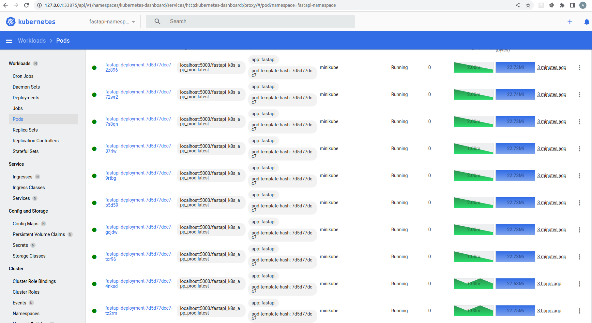

### Requirements

In order to launch the project locally you need the following:

* docker engine
* `docker-compose`
* `minikube` with nginx ingress controller addon enabled
* `make`
* `kubectl`

### Local run

To launch the app locally using your local docker engine, make sure port `8000` is not allocated on your host machine and launch

```bash
make run
```

`run` target in Makefile launches `dev` service from `docker-compose.yaml` which launches `uvicorn` daemon with `--reload` option allowing you to change the source and see the changes locally.

Once `make run` succeeds, you should be able to navigate to `http://127.0.0.1/` and see something like 

```bash
{"timestamp":1680353669.5468233,"hostname":"42bc3f9174d9"}
```

To stop all the containers:

```bash
make stop
```

To launch the whole test suite locally:

```bash
make test
```

Do not launch `test` service via docker-compose without `MY_GID` and `MY_UID` env vars set to your GID and UID respectively. This will make the linter make changes on behalf of root user inside the container and will change the permissions of your source files. 

### Local run in K8S

We selected [minikube](https://minikube.sigs.k8s.io/docs/start/) as the local k8s provider. Used docker driver for testing purposes. We will not use Helm or any other release/template manager as it was not requested in the task. We will store the whole manifest in a single `k8s.yaml` file in the project root.

The following make target will:
* prepare all necessary `minikube` addons (`registry`, `ingress`)
* setup port forwarding between the registry service and the host machine
* build the prod image and
* push it to the local registry

```bash
make minikube-prepare
```

To find the current URL of the nginx ingress URL, launch 

```bash
kubectl -n fastapi-namespace get ingress -o json | jq -r '.items[].status.loadBalancer.ingress[].ip'
```

You may need to wait for a couple of minutes till nginx ingress obtains the IP of the docker network via docker minikube virtualization driver.

It should output something like `192.168.49.2`. If you visit this URL (HTTP on port 80) you will see the app output balanced between the two pods evenly (round robin?).

We can setup session affinity (aka sticky sessions) based on cookie or client IP policies as nginx ingress allows. But this is out of scope of this task. 


### Monitoring

`minikube` has metrics addon, which can be enabled with 

```bash
minikube addons enable metrics-server
```

and which shows you VERY basic info about your cluster and deployments. This is by no means a replacement to traditional Grafana + Prometheus tooling set, but for this test purposes it serves the role.

```bash
minikube dashboard --url=true
```

will show you the dashboard URL. If you navigate to it, you will be able to manage your deployment (scale up and down) and see the CPU and RAM usage of all your deployment pods.




### Possible Improvements

* Grafana + Prometheus + PVC's + Service Accounts + RBAC
* Github action to deploy to GKE
* Adding HPA instead of fixed replicas count
* restricting RBAC to allow write access only for the service account of Github action and everything else is readonly
